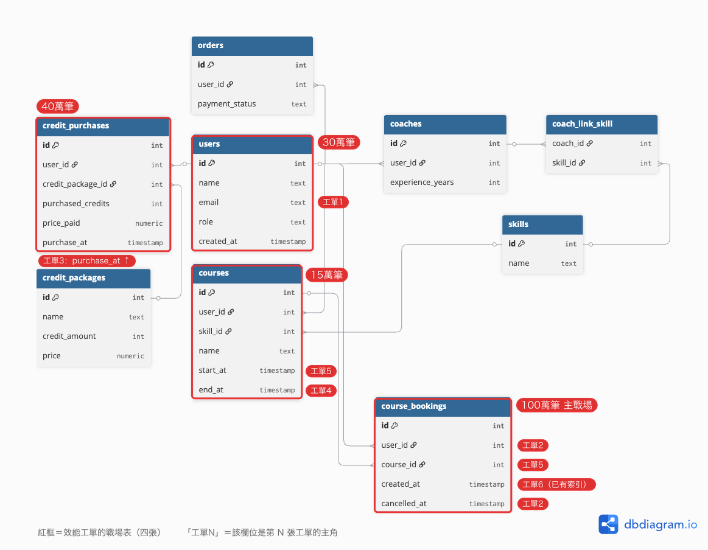

# 🚑 W7 效能急救室 — LiveFit 爆紅了

## 【任務情境】

LiveFit 健身平台爆紅，平台資料庫目前有相當大量的資料（30 多萬筆會員、100 多萬筆報名資料...）。上個班次的工程師在下班前，將六張營運單位提出的效能工單交接過來，你的任務就是了解這些工單提到的查詢問題（速度慢），再嘗試優化調整來解決這六張工單的查詢問題。

這週不會更動到應用程式邏輯，而是專注在資料庫跟查詢優化。請運用第七週學習的 **EXPLAIN、索引、查詢改寫** 等，來嘗試優化調整這六張工單。

> **資料量才是索引存在的理由**

## 【環境準備】

1. 安裝並啟動 [Docker Desktop](https://www.docker.com/products/docker-desktop/)，並確認 Node.js 版本 >= 20
2. **Fork** 作業專案 [https://github.com/hexschool/node-js-week7-2026](https://github.com/hexschool/node-js-week7-2026)，再 clone 同學自己的 fork
   - 這次需使用到 Fork，因為最終驗收是要跑自己 Repo 的 GitHub Actions
   - Fork 專案之後進到自己 Repo 的 **Actions** 分頁，按下「**I understand my workflows, go ahead and enable them**」按鈕，因為 GitHub 對於 fork 過來的專案預設會關閉 Actions，所以我們需手動啟用。

3. 啟動環境並載入資料：

```bash
cp .env.example .env
npm install
npm start          # 透過 Docker 啟動 LiveFit 資料庫，會自動等它就緒（如果執行沒有問題，會在終端機看到：等資料庫就緒. ✅）
npm run seed       # 載入約 130 萬筆資料，大約需 10~30 秒（如果執行沒有問題，會在終端機看到：✅ 完成）
npm run measure    # 查看初始狀況：六張工單全是紅燈
```

4.（建議）使用 DBeaver 連上資料庫：
  - 透過這樣的可視化工具，可以幫助我們更了解資料庫（表）狀況
  - 連線資訊：同 `.env` 看到的：localhost:5432 / student / student666 / 資料庫 livefit
  - DBeaver 相關補充（連結...待）

## 【主線任務】
六張工單的完整內容都在 `scripts/tickets.js`（唯讀，不需更動）。

這週作業只會更動兩個檔案：

- `optimize.sql`：範圍涵蓋工單 1～5，在對應的工單區塊撰寫解法（`CREATE INDEX`）
- `queries/06-rewrite.sql`：在這個檔案撰寫工單 6 的解法（改寫查詢部分）

**資料表地圖**

這張資料表地圖的紅框跟標記，列出了 LiveFit 各張資料表狀況、資料表之間的關聯，以及欄位與下方工單的關係。
在處理工單之前，或者是過程中都可用於參考跟對照。（這張圖也放在專案的 docs/livefit-erd-annotated.png）



本週六張工單：

**工單 1：客服查會員**
* 情境：客服輸入會員 email 查資料需等好幾秒，客人都等到掛電話了...
* 狀況：目前每次查詢，都會把整張 30 萬筆的 users 資料表掃過一遍，才能找出條件符合的那一筆資料

**工單 2：企業會員的課表打不開**
* 情境：企業戶「喵喵物流」反映，打開團課課表時，畫面要轉好久
* 狀況：目前打開課表時，都會在 100 多萬筆報名資料裡，一筆一筆的過濾出這個企業會員「還沒取消」的紀錄

**工單 3：最新購買紀錄牆**
* 情境：後台首頁要顯示最新 100 筆購買紀錄，但每次進來都會卡一下
* 狀況：目前如果要取得最新的 100 筆，資料庫就得先把整張 40 萬筆購買紀錄都排序過一遍

**工單 4：首頁「進行中課程」**
* 情境：首頁「進行中課程」區塊越來越慢（上個班次的工程師曾經在 `start_at` 加過索引，但因為沒有效果，所以就先刪除了）
* 狀況：目前每次都需把整張 15 萬筆的課程資料表掃過一遍，才能過濾出「現在正在進行」的那幾堂課程

**工單 5：上週開課課程的教練報名統計**
* 情境：每週開會都需要看「上週開課課程」的教練報名數量，但查詢這張報表實在太慢，所以大家都會先去泡咖啡
* 狀況：目前這張報表要把課程、報名、會員三張資料表關聯，而資料量一大就會卡住。（導致查詢慢的狀況不只一個）

**工單 6：爆量日報名查詢**
* 情境：上個班次工程師交接提到，已經加了 `created_at` 索引，但客服說查詢 6/24 週年慶那天的報名還是超慢
* 狀況：原因是這條查詢用不到已建立的索引，所以還是把整張資料表都掃過一遍（這張資料表不可再加索引，方向為改寫查詢）

**加分題（選做）**
* 挑戰：試著用部分索引（partial index），讓工單 2 的索引更小、更有效率（撰寫位置在 `optimize.sql` 最下方）


每張工單的處理流程：

1. 先在終端機執行 `npm run measure 1`，最後的數字根據當下處理的工單編號而定，看看目前工單的狀況（初始未調整時會看到 🔴 燈號）
2. 接著到 `scripts/tickets.js` 了解工單的內容。這時也可複製這張工單的 SQL 查詢，然後貼進 DBeaver 並在前面加上 `EXPLAIN ANALYZE` 執行一次，觀察資料庫實際是怎麼跑這條查詢的：
   - 看它是不是在「掃整張資料表」（執行計畫裡會看到 `Seq Scan` 關鍵字）
   - 對照查詢的 WHERE／JOIN 條件，判斷是卡在哪個欄位上（這就是下一步要對症下藥的地方）
3. 把解法寫進對應的檔案，工單 1～5 在 `optimize.sql` 建立索引；工單 6 在 `queries/06-rewrite.sql` 改寫查詢
4. 執行 `npm run optimize`，把寫好的 SQL 套用到資料庫（工單 6 改寫查詢可省略這個步驟，寫完直接到第 5 步測試即可）
5. 再跑一次 `npm run measure 1` 來確認燈號，如果看到 🟢 燈號表示過關，可繼續進到下一個工單的調整

燈號含義：
- 🔴：目前還是掃整張資料表，還需再優化調整
- 🟡：有使用到索引，不過還能優化的更精準（Rows Removed）
- 🟢：優化沒有問題，此工單過關


## 【測試】

**作業繳交前必須通過**：

- `npm run measure`：看到「六張工單全數結案」訊息（涵蓋在繳交作業的內容中，因此可先截圖）
- `npm test`：✓ 表示通過、✕ 表示失敗，最終看到 `Tests: 8 passed, 8 total` 即代表全數通過。

| 群組 | 測試數量 |
|---|---|
| 工單 1～5（各一條） | 5 |
| 工單 6（有改寫／結果一致／吃到索引） | 3 |

繳交前提醒：
這週只需在 `optimize.sql` 和 `queries/06-rewrite.sql` 這兩個檔案撰寫答案；
其餘檔案（`scripts/`、`test/`、`.github/`、`package.json`、`package-lock.json`、`docker-compose.yml`、`.env.example`）都不可更動。

**不可更動的檔案，助教們在批改時會抽查是否有被改過，若發現有更動的話，則會將作業退回！**

## 【常見問題】

**Q：`npm start` 出現「等了 60 秒資料庫還沒就緒...」？**
A：先確認 Docker Desktop 有開著（資料庫是跑在 Docker 裡的）。如果確定有開、但還是卡住，可以執行 `docker compose logs postgres` 看資料庫的啟動訊息，通常就能看出原因。

**Q：5432 這個 port 被電腦上其他程式佔用？**
A：
承上題，如果 Docker 有開啟但 `npm start` 還是失敗，有個常見原因是「5432 這個 port 已經被電腦上其他程式佔用」（最常見的是本機自己裝的 PostgreSQL）。可以這樣處理：

- 調整方向一，把 `.env` 裡的 `DB_PORT` 改成其他號碼（例如 5433），再執行 `npm run db:reset` 重新啟動。compose 和所有腳本都會去讀這個值。（如果有使用 DBeaver，記得連線的 port 也需要一起更改。）
- 調整方向二，如果能確定佔用的那個程式不重要、停掉也不會影響系統運作，也可以直接把它停用，讓 5432 port 空出來。

**Q：`npm run seed` 可以重跑嗎？**
A：可以隨時重跑。每次執行都會先清掉舊資料，然後重新建立資料表再灌入，所以不會殘留或疊加到舊的資料；加上它用的是固定的亂數種子，每次產生的資料內容都完全相同。如果想要資料庫整個重來，就使用 `npm run db:reset`。

**Q：把 `scripts/tickets.js` 的查詢貼進 DBeaver，跳出一個視窗要我填 `STORY_NOW` 的值？**
A：工單 4、5 的查詢裡有 `${STORY_NOW}`，這是本次作業固定的時間依據（2026-07-24 18:00）。DBeaver 會把 `${...}` 當成「變數」，所以執行時會跳出視窗要我們填寫它的值，可以在視窗裡填入 `TIMESTAMPTZ '2026-07-24 18:00:00+08'`；或者比較單純的方式，是在貼進 DBeaver 之前，先將查詢裡的 `${STORY_NOW}`（可能有多個）都手動換成 `TIMESTAMPTZ '2026-07-24 18:00:00+08'` 再執行。

**Q：建立索引之後，measure 還是顯示紅燈？**
A：索引建立好不等於有被使用到。可在 DBeaver 對這條 SQL 查詢跑一次 `EXPLAIN ANALYZE` 看執行計畫，如果計畫中還是有看到 `Seq Scan` 關鍵字，代表資料庫沒有使用到你建立的索引。常見原因有兩個，一個是索引建立在不對的欄位，另一個則是條件本來就篩選不掉多少資料，所以資料庫判斷掃整張表會比較快。

**Q：工單 4 的索引一直沒有效果？**
A：根據題目線索，上一位工程師有在 `start_at` 加過索引，但是沒有啟到作用。工單 4 的查詢有兩個範圍條件，可思考看看哪一個能篩選掉比較多資料，然後將索引建立在這個欄位上。

**Q：工單 2 一直顯示黃燈？**
A：黃燈代表索引有被使用到，但是撈回來的資料大部分又被篩選掉（measure 會印出 Rows Removed，數字偏大）。這代表目前索引還不夠精準，可以往「複合索引」的方向來思考。如果調整為複合索引後還是顯示黃燈，可檢查一下舊的單欄索引是不是還保留著，可以把這個沒有使用到的索引先 `DROP` 掉，再重新測 `measure`。

**Q：工單 6 想對 `DATE(created_at)` 建立索引，但是 PostgreSQL 直接報錯？**
A：這是正常的。`created_at` 帶有時區，用 `DATE()` 轉換出來的日期會隨資料庫的時區設定而變，所以不是一個固定不變的結果；而 PostgreSQL 只允許「結果固定」的運算式拿來建立索引（IMMUTABLE），所以它會擋下對 `DATE(created_at)` 建立索引。這個錯誤本身就是工單 6 的練習主軸，並不是要調整索引，而是要從改寫查詢著手，讓條件回到 `created_at` 本身。

**Q：本機 measure 全部通過，但 CI（GitHub Actions）卻是未通過？**
A：最常見的原因是索引只有在 DBeaver 裡建立、沒有寫進 `optimize.sql`。本機的 DBeaver 和專案連的是同一個資料庫，所以你在 DBeaver 建立的索引，本機 measure 也看得到、會跟著同步；但 CI 跑的是一個全新的資料庫，只會執行 `optimize.sql` 裡的內容。因此在 DBeaver 測試成功的索引，記得補回 `optimize.sql`，CI 才會跟著通過。